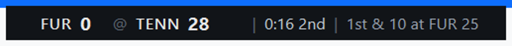
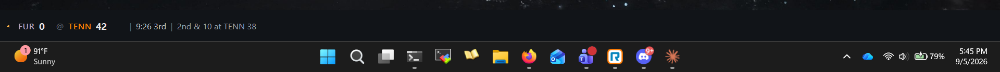

# CFB Ticker

A small always-on-top college football score strip for Windows 11. Pick a game (or two), and it sits on your screen showing the score, clock, quarter, down and distance, and who has the ball, refreshing every ten seconds while the game is live. No stats, no odds, no news. Glance at it all afternoon and otherwise forget it is there.



Two placement modes. Floating, where you drag it anywhere and it stays on top of everything; or docked to the taskbar edge, where Windows reserves the space so maximized windows stop above it instead of covering it.



## What it shows

Each row is one game: away team and score, home team and score, the clock and quarter (or Halftime, Final, or kickoff time), and the current down and distance. A small orange marker points at the team with possession; it turns red in the red zone. Team abbreviations take the team's own color, lightened when the color is too dark to read on the strip, and ranked teams carry their AP rank.

While a game is live, a score that just changed flashes for a moment so a glance tells you something happened. Hovering the row shows the last play. Before kickoff the down-and-distance slot shows the network instead (ABC, SECN+), and finished games dim so the live ones stand out.

If the feed stops answering, the last known score stays up and a small "stale" tag appears after sixty seconds, so you always know whether you are looking at live data.

## Install

Download `CFBTicker.exe` from the latest release and run it. There is no installer; it is one file, and the only thing it writes to your machine is its settings, under `HKCU\Software\KaseyKubiak\CFBTicker` in the registry.

**Windows SmartScreen will warn you the first time.** The executable is not code-signed (that costs money and this is a hobby project), so Windows shows "Windows protected your PC". Click "More info", then "Run anyway". You will only see it once.

The first launch shows an empty strip. Right-click it, or the tray icon, and choose "Pick games..." to get started.

## Using it

Everything lives in the right-click menu, which is the same whether you right-click the strip or the tray icon (the small football in the notification area).

- **Pick games...** opens today's slate, grouped into Live, Upcoming and Final, with a Favorites group at the top for any game involving a team you have starred. Check up to two games; the first one you check is the top row. Add favorite teams on the left side of the same dialog.
- **Auto-follow favorites** (on by default) fills an empty row with a favorite team's game when it goes live, and drops a game ten minutes after it ends. It never replaces a game you picked that is still live or upcoming. Star a few teams in the picker and the strip runs a Saturday on its own.
- **Hide ticker / Show ticker** does what it says. The tray icon stays so you can bring it back.
- **Placement** switches between Floating and Docked to taskbar edge. Docked mode reserves screen space the way the taskbar itself does. If you have more than one monitor, a "Dock on screen" submenu appears to choose which one.
- **Start with Windows** adds or removes the ticker from your startup apps (it uses the standard per-user Run key, so it also shows up in Task Manager's Startup tab, where you can turn it off without the app).
- **Quit** exits. Closing the strip does not; the app lives in the tray.

Your selected games, favorites, placement mode and window position are remembered between runs.

Polling adapts to the game state: every 10 seconds while a selected game is in progress, every minute before kickoff, every five minutes once everything is final. If a request fails, it backs off to a minute and keeps trying.

## Running from source

Python 3.12 and [uv](https://docs.astral.sh/uv/) are the only prerequisites.

```
git clone https://github.com/kaseykubiak-dev/cfb-ticker.git
cd cfb-ticker
uv sync
uv run python -m cfb_ticker
```

Optional arguments: one or two ESPN event ids to select games from the command line (they replace the saved selection), `--placement floating|appbar` to override the saved placement for that run, and `-v` to log each fetch to the console.

```
uv run pytest
```

runs the test suite, which works against a saved scoreboard response in `tests/fixtures/` and does not touch the network.

## Building the .exe

```
uv run pyinstaller build.spec
```

produces `dist/CFBTicker.exe`. The spec excludes the Qt modules the app never loads (WebEngine, QML, Multimedia and so on), which is what keeps a PySide6 build to a reasonable size.

## Where the scores come from

The strip reads the same public JSON that espn.com's own scoreboard page renders from. It needs no API key, updates within seconds of the broadcast, and carries the live situation data (down, distance, possession) that the keyed APIs either lack or lag on.

The trade-off is that it is undocumented and unofficial. ESPN could change the shape of it, move it, or start blocking it, at any time and without notice. The data layer is behind a small adapter interface so a different source can be swapped in if that day comes, but as of this writing there is no fallback wired up, and if the feed goes away the strip will show "stale" and keep retrying rather than showing anything wrong.

One thing already learned the hard way: one of ESPN's two hostnames sits behind bot detection that rejects requests pretending to be a browser. The app identifies itself honestly as `cfb-ticker` and tries the hostname that does not care first.

## Scope

College football only, one or two games, Windows 11 only (it uses the Windows AppBar API for docked mode and the registry for settings). It is built for exactly one job and not intended to grow into a scoreboard app.

## License

MIT. PySide6 is LGPL and is used unmodified as a dynamically linked library, which the LGPL permits.
